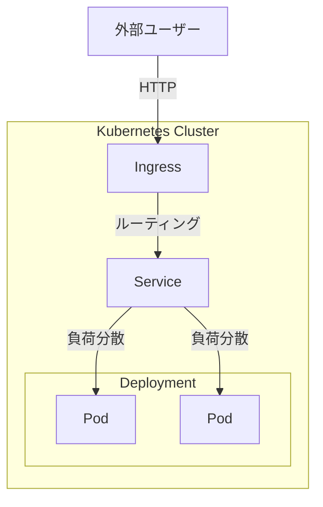

## はじめに

本記事は、KubernetesとHelmに初めて触れる方に向けた入門記事です。基本概念の理解から、minikubeを使ったローカル環境でのアプリデプロイまでを扱います。

### この記事で学べること

- Kubernetesの主要なオブジェクト（Pod、Deployment、Service、Ingress）
- マニフェストファイルの書き方
- Helmによるパッケージ管理の基本
- minikubeでのローカルデプロイ

### 前提知識

- Dockerとコンテナの基本的な概念
- ターミナル操作の基礎

### Kubernetesの全体像



外部からのリクエストは、Ingress → Service → Podの順に流れます。Deploymentは指定した数のPodを維持します。

## Kubernetes

Kubernetesは、コンテナ化されたアプリケーションのデプロイ、スケーリング、運用を自動化するためのオープンソースプラットフォームです。

> Kubernetes is a portable, extensible, open source platform for managing containerized workloads and services, that facilitates both declarative configuration and automation.

<https://kubernetes.io/docs/concepts/overview/>

Kubernetesを使うと、以下のようなことが自動化できます。

- **コンテナの起動・停止**: 「Podを3つ起動する」と定義すれば、Kubernetesが常に3つを維持
- **スケーリング**: アクセス増加時にPodを増やし、落ち着いたら減らす
- **自己修復**: Podがクラッシュしても、自動で新しいPodを起動して復旧

これにより、安定した運用と効率的なリソース管理を実現できます。

## Kubernetes Objects

Kubernetesでは、アプリケーションの構成を「オブジェクト」として定義します。「Podを3つ動かしたい」「外部からアクセスできるようにしたい」といった望ましい状態を記述すると、Kubernetesがその状態を維持してくれます。

> Kubernetes objects are persistent entities in the Kubernetes system. Kubernetes uses these entities to represent the state of your cluster.

<https://kubernetes.io/docs/concepts/overview/working-with-objects/>

本記事で扱う主要なオブジェクトは以下のとおりです。

| オブジェクト       | 説明                                         |
| ---------------- | -------------------------------------------- |
| **Pod**          | コンテナを実行する最小単位（通常は1コンテナ） |
| **Deployment**   | Podの数を維持し、更新やスケーリングを管理     |
| **Service**      | Podへのネットワークアクセスを提供する         |
| **Ingress**      | 外部からのHTTPリクエストをServiceへルーティングする |

次のセクションでは、これらのオブジェクトをYAMLファイル（マニフェスト）で定義する方法を説明します。

## マニフェストファイル

マニフェストは、Kubernetesオブジェクトを定義するYAMLファイルです。「こういう状態にしてほしい」という設定を記述し、Kubernetesに適用します。

マニフェストを使う利点は以下のとおりです。

- **宣言的な管理**: 望ましい状態を書くだけで、Kubernetesが自動で維持してくれる
- **バージョン管理**: YAMLファイルなのでGitで変更履歴を追跡できる
- **再現性**: 同じマニフェストを適用すれば、別の環境でも同じ構成を再現できる

### マニフェストの基本構造

マニフェストには以下の必須フィールドがあります。

| フィールド      | 説明                                                       |
|-----------------|-----------------------------------------------------------|
| **apiVersion**  | Kubernetes APIのバージョン                                 |
| **kind**        | オブジェクトの種類（Deployment、Serviceなど）              |
| **metadata**    | オブジェクト名やラベルなどの識別情報                       |
| **spec**        | 望ましい状態（Pod数、コンテナイメージなど）を記述         |

```yaml
apiVersion: apps/v1
kind: Deployment
metadata:
  name: my-app
spec:
  replicas: 2
  # Podのテンプレート（containers、imageなど）を定義
```

マニフェストは `kubectl apply` コマンドでKubernetesに適用します。

```bash
kubectl apply -f deployment.yaml
```

これにより、Kubernetesは指定されたオブジェクトを作成し、望ましい状態を維持します。

### Deployment

Deploymentは、Podの起動・維持・更新を管理するオブジェクトです。

> A Deployment manages a set of Pods to run an application workload, usually one that doesn't maintain state.

<https://kubernetes.io/docs/concepts/workloads/controllers/deployment/>

Deploymentを使うと、以下のことが自動化されます。

- 指定した数のPodを常に維持
- アプリケーションのローリングアップデート（段階的な更新）
- 障害時の自動復旧

```yaml:deployment.yaml
apiVersion: apps/v1
kind: Deployment
metadata:
  name: nginx-deployment
spec:
  replicas: 2
  selector:
    matchLabels:
      app.kubernetes.io/name: proxy
  template:
    metadata:
      labels:
        app.kubernetes.io/name: proxy
    spec:
      containers:
      - name: nginx
        image: nginx:stable
        ports:
        - containerPort: 80
          name: http-web-svc
```

| フィールド      | 説明                                                         |
|-----------------|-------------------------------------------------------------|
| **replicas**    | 起動するPodの数                                              |
| **selector**    | 管理対象のPodを識別するラベル条件                            |
| **template**    | 作成するPodの定義（ラベル、コンテナ、ポートなど）            |

```bash
kubectl apply -f deployment.yaml
```

これでDeploymentが作成され、指定した数のPodが起動します。

### Service

Serviceは、Podへのネットワークアクセスを提供するオブジェクトです。

Podは動的に作成・削除されるため、IPアドレスが変わります。Serviceを使うと、固定のIPやDNS名で複数のPodにアクセスできるようになります。

> Expose an application running in your cluster behind a single outward-facing endpoint, even when the workload is split across multiple backends.

<https://kubernetes.io/docs/concepts/services-networking/service/>

```yaml:service.yaml
apiVersion: v1
kind: Service
metadata:
  name: nginx-service
spec:
  selector:
    app.kubernetes.io/name: proxy
  ports:
  - name: name-of-service-port
    protocol: TCP
    port: 80
    targetPort: http-web-svc
```

| フィールド       | 説明                                               |
|------------------|---------------------------------------------------|
| **selector**     | 対象Podをラベルで指定（Deploymentと一致させる）    |
| **port**         | Serviceが受け付けるポート                          |
| **targetPort**   | 転送先のPodのポート（名前または番号で指定）        |

```bash
kubectl apply -f service.yaml
```

これでServiceが作成され、Podへの安定したアクセス経路が確保されます。

### Ingress

Ingressは、クラスタ外部からのHTTP/HTTPSリクエストを内部のServiceにルーティングするオブジェクトです。ホスト名やURLパスに基づいて、リクエストを振り分けられます。

> Make your HTTP (or HTTPS) network service available using a protocol-aware configuration mechanism, that understands web concepts like URIs, hostnames, paths, and more.

<https://kubernetes.io/docs/concepts/services-networking/ingress/>

```yaml:ingress.yaml
apiVersion: networking.k8s.io/v1
kind: Ingress
metadata:
  name: nginx-ingress
spec:
  ingressClassName: nginx
  rules:
    - host: example.local
      http:
        paths:
          - path: /
            pathType: Prefix
            backend:
              service:
                name: nginx-service
                port:
                  number: 80
```

| フィールド             | 説明                                              |
|------------------------|--------------------------------------------------|
| **ingressClassName**   | 使用するIngress Controllerを指定                  |
| **rules**              | ホスト名・パスごとのルーティング定義              |
| **backend.service**    | リクエストの転送先Service                         |
| **pathType**           | パスのマッチ方式（`Prefix`: 前方一致、`Exact`: 完全一致） |

```bash
kubectl apply -f ingress.yaml
```

これでIngressが作成され、外部からServiceへのアクセスが可能になります。

:::message
**Gateway APIについて**
Kubernetesでは、Ingressに代わる新しいAPIとしてGateway APIが登場しています。Ingress NGINX Controllerは2025年11月に廃止が予告され、2026年3月以降はサポート終了予定です。新規プロジェクトではGateway API（Envoy Gateway、Cilium等）の採用を検討してください。
<https://kubernetes.io/docs/concepts/services-networking/gateway/>
:::

## Helm

Kubernetesでは、アプリケーションを構成するマニフェストが複数ファイルに分かれます。環境ごとに設定を変えたり、複数のアプリで似た構成を再利用したい場合、管理が煩雑になりがちです。

Helmは、Kubernetesマニフェストをテンプレート化し、パッケージとして管理するツールです。

> Helm helps you manage Kubernetes applications — Helm Charts help you define, install, and upgrade even the most complex Kubernetes application.

<https://helm.sh/>

## Helm Chart

Helm Chartは、Kubernetesアプリケーションをパッケージ化したものです。マニフェストのテンプレートと設定値をまとめて管理できます。

> A Chart is a Helm package. It contains all of the resource definitions necessary to run an application, tool, or service inside of a Kubernetes cluster.

### チャートの構成

```bash
mychart/
  Chart.yaml          # チャートのメタ情報（名前、バージョンなど）
  values.yaml         # 設定値のデフォルト（テンプレートに埋め込まれる）
  templates/          # マニフェストのテンプレート
    deployment.yaml
    service.yaml
    ingress.yaml
```

テンプレート内では `{{ .Values.image.repository }}` のようにテンプレート構文で値を埋め込みます。これにより、開発・ステージング・本番など環境ごとに設定を変えて、同じチャートを再利用できます。

## minikubeでアプリをデプロイする

ここまで学んだ内容を使って、実際にminikube上でNginxアプリケーションをデプロイします。

> minikube quickly sets up a local Kubernetes cluster on macOS, Linux, and Windows.

<https://minikube.sigs.k8s.io/docs/>

### minikubeの起動

```bash
minikube start
```

クラスタが起動していることを確認します。

```bash
kubectl get nodes
```

### Helmチャートの作成

```bash
helm create mychart
cd mychart
```

### values.yamlを編集

values.yamlを以下のようにシンプル化します。

```yaml:values.yaml
replicaCount: 2

image:
  repository: nginx
  tag: stable
  pullPolicy: IfNotPresent

service:
  type: ClusterIP
  port: 80

ingress:
  enabled: true
  className: nginx
  hosts:
    - host: example.local
      paths:
        - path: /
          pathType: Prefix
```

### テンプレートファイルの編集

templates/配下のファイルを以下の内容で置き換えます（helm createで生成されるデフォルトのテンプレートは複雑なため、学習用にシンプル化しています）。

```yaml:deployment.yaml
apiVersion: apps/v1
kind: Deployment
metadata:
  name: {{ include "mychart.fullname" . }}-deployment
spec:
  replicas: {{ .Values.replicaCount | default 1 }}
  selector:
    matchLabels:
      app.kubernetes.io/name: {{ include "mychart.name" . }}
  template:
    metadata:
      labels:
        app.kubernetes.io/name: {{ include "mychart.name" . }}
    spec:
      containers:
        - name: {{ .Chart.Name }}
          image: "{{ .Values.image.repository }}:{{ .Values.image.tag }}"
          imagePullPolicy: {{ .Values.image.pullPolicy }}
          ports:
            - containerPort: {{ .Values.service.port }}
              name: http-web-svc

```

```yaml:service.yaml
apiVersion: v1
kind: Service
metadata:
  name: {{ include "mychart.fullname" . }}-service
spec:
  type: {{ .Values.service.type }}
  selector:
    app.kubernetes.io/name: {{ include "mychart.name" . }}
  ports:
    - name: http
      protocol: TCP
      port: {{ .Values.service.port }}
      targetPort: http-web-svc
```

```yaml:ingress.yaml
{{- if .Values.ingress.enabled }}
apiVersion: networking.k8s.io/v1
kind: Ingress
metadata:
  name: {{ include "mychart.fullname" . }}-ingress
spec:
  ingressClassName: {{ .Values.ingress.className }}
  rules:
    {{- range .Values.ingress.hosts }}
    - host: {{ .host }}
      http:
        paths:
          {{- range .paths }}
          - path: {{ .path }}
            pathType: {{ .pathType }}
            backend:
              service:
                name: {{ include "mychart.fullname" $ }}-service
                port:
                  number: {{ $.Values.service.port }}
          {{- end }}
    {{- end }}
{{- end }}
```

### Ingress Controllerを有効化

```bash
minikube addons enable ingress
```

反映が完了したか確認します。すべてのPodが`Running`になるまで待ちます。

```bash
kubectl get pods -n ingress-nginx --watch
```

### アプリケーションのインストール

```bash
helm install myapp .
```

インストールされたリソースを確認します。

```bash
kubectl get all
kubectl get ingress
```

### hostsファイルの設定

minikubeのIPアドレスを取得し、example.localをローカルで解決できるようにします。

```bash
minikube ip
```

/etc/hostsに追記します（sudo権限が必要）。

```bash
echo "$(minikube ip) example.local" | sudo tee -a /etc/hosts
```

または手動で編集する場合は、`minikube ip`で取得したIPアドレスを使用してください。

```bash
sudo vi /etc/hosts
# 以下を追記（IPアドレスは環境によって異なります）
# 192.168.49.2 example.local
```

### 動作確認

別のターミナルを開いて、minikube tunnelを起動します（パスワードを求められる場合があります）。

```bash
minikube tunnel
```

tunnelは起動したままにしておきます。ブラウザで <http://example.local> にアクセスし、Nginxの初期画面が表示されれば成功です。

## まとめ

本記事では、以下の内容を紹介しました。

- Kubernetesの主要なオブジェクト（Pod、Deployment、Service、Ingress）
- マニフェストファイルの基本構造
- Helmによるパッケージ管理
- minikubeを使ったローカル環境でのデプロイ

Kubernetesは学ぶことが多いですが、まずは手を動かして試してみることが理解への近道です。この記事が、Kubernetesを学び始める方の参考になれば幸いです。
